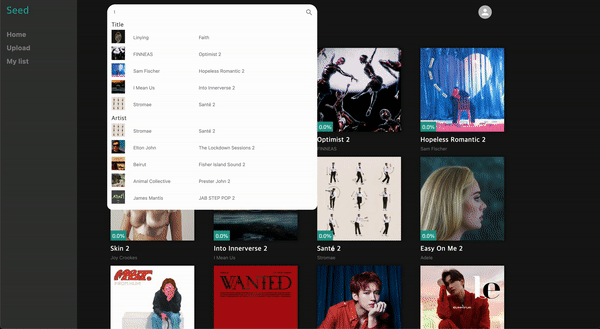

# 🌱 **Seed**

**음원을** **공유하고** QR 코드 결제를 통해 아티스트를 후원할 수 있는 클라우드 펀딩 웹 서비스


## 🛫 **Link**
[Client Repository](https://github.com/Seed-751/Seed-client) | [Server Repository](https://github.com/Seed-751/Seed-server) | [Live](https://seed751.live/)

## 🎯 **Table of Contents**

1. [🔎 Preview](#-Preview)
2. [💡 Motivation](#-Motivation)
3. [🔨 Tech stack](#-Tech-stack)
4. [💿 Features](#-Features)
5. [🗓 Schedule](#-Schedule)
6. [⛵️ Project Log](#-Project-Log)
    - [🔅 전역 State의 비동기 로직 관리, Redux-Toolkit Saga](#-전역-State의-비동기-로직-관리-Redux-Toolkit-Saga)
    - [🔅 음악파일 보안 이슈](#-음악파일-보안-이슈)
    - [🔅 413 Cors 에러](#-413-Cors-에러)
    - [🔅 Audio File Metadata](#-Audio-File-Metadata)
    - [🔅 Lighthouse Performance 향상, 66 => 93](#-Lighthouse-Performance-향상,-66-=>-93)
7. [✨ 프로젝트 후기](#-프로젝트-후기)

<br>

## 🔎 **Preview**

- 음악을 업로드하여 게시할 수 있습니다.


<br>

- 음악을 듣고 카카오페이로 결제하여 후원이 가능합니다.


<br>

- 찾고 싶은 음악 제목이나 아티스트 이름으로 검색할 수 있습니다.



<br>

- 검색어의 결과를 미리 보고 다른 페이지에서도 바로 조회할 수 있습니다.


<br>

## 💡 **Motivation**

크라우드 펀딩 서비스에서 착안하여 제작하였습니다. 요즘에는 펀딩을 하는 서비스가 다양한데 음악이라는 영역은 안정적으로 지원받기가 어려운 점이 있다고 생각해서 펀딩 서비스를 같이 연결해보면 좋겠다는 생각으로 시작했습니다.

<br>

## 💿 **Features**
- 메인페이지에서 게시글을 확인할 수 있습니다.
- 사용자는 후원받고 싶은 음악 샘플을 사진, 제목, 설명과 함께 올릴 수 있습니다.
- 음악 파일은 100초 이하의 길이이며, 음악 한 곡당 100만 원을 목표로 하여 앨범 단위로 게시글을 올릴 수 있습니다.
- 검색기능을 통해 앨범을 조회 할 수 있습니다.
- 상세페이지에서 음악 샘플을 듣고 후원할 수 있습니다.
- 사용자는 후원하고 싶은 앨범에 카카오페이로 결제하여 후원할 수 있습니다.

<br>

## 🔨 **Tech stack**

**Common**

- ES6+

**Frontend**

- React
- Redux
- Redux-Toolkit
- Redux Saga
- Styled Component

**Backend**

- Node.js
- Express
- Mongo DB, Atlas
- Mongoose

**Etc**

- Elastic Beanstalk (EC2, S3)
- Iamport

<br>

## 🗓 **Schedule**

- **기획 :** 2020/09/27 ~ 2020/10/03 **(1주)**
    - **1주차 프로젝트 아이디어 기획,** mock up 제작, 기술스택 검토 및 계획수립
- **개발 :** 2020/10/04 ~ 2020/10/15 **(2주~3주)**
    - **2, 3주차** 기능 구현, 리팩토링

<br>

## ⛵️ **Project Log**

### 🔅 **전역 State의 비동기 로직 관리 Redux-Toolkit, Saga**

- 이전 프로젝트에서는 Thunk를 사용하였는데 단점은 Action 함수의 크기가 커져 나중에 로직이 더욱 커지게 되면 더 복잡해질 수도 있는 것 그리고 관심사가 덜 분리 되는 것이었습니다. saga를 도입하게 된 이유는 새로운 기술을 도입하고 싶다는 이유도 있었지만 조사한 결과 액션에 대한 리스너로 객체를 반환하여 관심사를 더 잘 분리할 수 있고 겉으로 보기에도 코드의 가독성도 높아 보이기 때문이었습니다.

- 실제 도입해본 결과 Thunk보다 코드의 가독성도 높아졌고 Side Effect를 따로 관리하여 관심사를 분리하고 Reducer의 순수성을 더 보장하는 것을 배웠습니다.

- 공식문서에도 나와 있는 부분으로 Saga는 순수함수로 복잡한 로직을 간단하게 표현하여 테스트에도 적합하다는 것도 장점이었습니다.

  <details>
  <summary>redux saga test logic 예시</summary>

  ```js
  describe("Request signup in userSaga test", () => {
    it("Request signup success => ", () => {
      const data = {
        email: "test@gmail.com",
        password: "test",
        name: "test",
      };

      const response = {
        success: true,
      };

      return expectSaga(handleSignupSaga, { payload: data })
        .withReducer(userReducer)
        .provide([[call(requestSignup, data), response]])
        .put({ type: "user/signupSuccess", payload: undefined })
        .hasFinalState({
          userInfo: null,
          isLoading: false,
          isLoggedIn: false,
          isSignupSuccess: true,
          error: null,
        })
        .silentRun();
    });
  });

  ```
  </details>
<br>

- Saga는 Generator라는 함수로 구성되어 로직을 delay, cancel, pause 등 더 제어할수 있는 특징을 가지고 그중에 takeLatest를 로직에 사용하였는데 비동기 로직을 감시하다 실행이 되었더라도 감시한 함수가 또 실행하게 되면 이전 요청에 대한 응답을 취소하기 때문에 사용자의 불필요한 연속적인 요청에도 대응할 수 있는 메서드로 비동기의 흐름을 세밀하게 제어하는 경험을 했습니다.

<br>

### 🔅 **음악파일 보안 이슈**

- 음악 파일을 후원하는 웹 서비스이기 때문에 보안적인 부분을 생각했습니다. 브라우저 검사 도구에서 Audio Tag의 Src를 쉽게 확인할 수 있어 유출 위험이 있었습니다.

- 이를 해결하기 위해 Audio Tag Src에서 노출되는 AWS S3 객체 url의 접근 권한을 설정했습니다. 서버 측 암호화를 위해 AWS S3에서 관리하는 SSE-S3 키를 사용했습니다. 하지만 직접 Bucket에서 업로드 할때는 접근 권한이 설정되어 타 사이트에서 접근이 거절되는 것을 확인했지만 작업한 프로젝트에서 업로드 할 때애는 암호화 설정이 안 되어서 적용이 되지 않았습니다.

- 조사한 결과 multer-s3에서는 SSE-S3 키는 지원이 되지 않아 KMS 키를 적용해야 했습니다. KMS 키를 적용하거나 multer-s3를 사용하지 않는 방법으로 시도해봐야 할것 같았지만 두 방법으로 시도하기에는 프로젝트 마감 기한에 맞추기 어렵다고 판단하여 오디오 파일의 Duration을 제한함으로써 100초 샘플로 설정하여 문제를 해결하였습니다. 접근 권한을 제대로 제한하지 못하여 아쉬움이 컸던 것 같습니다.

<br>

### 🔅 **413 Cors 에러**

- 파일 업로드를 하는 과정에서 413 Cors 에러 문제가 생겼습니다. AWS S3 Bucket 및 server측의 Cors 설정을 했기 때문에 문제점을 쉽게 찾지 못했습니다. 413 error를 조사한 결과 Request Entity Too Large였고 Cors라는 문구 때문에 문제점을 잘못인지 했습니다.

- Server에도 Express json limit 설정을 해두었었지만, 문제가 된 부분은 Elastic Beanstalk로 배포한 부분이었습니다. Elastic Beanstalk로 배포 할 때에 Nginx의 설정 값 중 Client Max Body Size가 1MB로 설정되어 있기 때문이었습니다. 설정값을 100MB로 변경하여 문제를 해결할 수 있었습니다.

<br>

### 🔅 **Audio File Metadata**

- 오디오 파일을 업로드 할때 duration, title, genre, artist, track, album 등의 Metadata 정보가 필요했습니다. duration의 경우는 onloadedmetadata event를 이용하여 구할 수 있었지만,나머지 정보들은 Web API를 이용하여 구하는 방법을 찾지 못하여 Jsmediatags 라이브러리를 이용하여 구했습니다.

- 파일을 읽어오는 과정에서 비동기 Promise All을 사용하였습니다. Promise All은 여러개의 비동기 로직들을 병렬로 처리하는데 오디오 파일을 다수 업로드 하는 과정에서 onloadedmetadata event, Jsmediatag의 onload 과정 등 에서 필요할 수 있다고 생각했습니다. Promise All을 사용하게 되면 비동기 로직들을 동시에 실행하기 때문에 시간을 단축할 수 있었고 또 파일이 한 개라도 에러가 났을경우 실패값을 반환하여 로직의 시간이 더 효율적으로 개선할 수 있었습니다.


  <details>
  <summary>비동기 로직의 Promise All</summary>

  ```js
  // accepted files validation

  const validateAcceptedFiles = await Promise.all(acceptedFiles.map((file) => {
    return validateAudio(file);
  }));

  // audio file validation method

  async function validateAudio(file) {
  ...
    const metadataResult = await validateMetaData(file);
  ...
  }

  // metadata validation method

  function validateMetaData(file) {
    return new Promise((resolve) => {
      jsmediatags.read(file, {
        onSuccess: function (tag) {
          const { title, album, track, genre, artist } = tag.tags;

          const errorMessage = [];

          if (!album) {
            errorMessage.push({ message: ERROR.inputMetaAlbum });
          }
          ...

          if (!errorMessage.length) {
            return resolve(null);
          }
          ...
      });
    });
  }

  ```
  </details>

<br>

### 🔅 **Lighthouse Performance 향상, 66 => 93**

<br>


- React.lazy를 통한 코드스플리팅을 하여 앱의 번들이 커져 초기 로드 시간이 길어지는 것을 줄였습니다.
- 당장 사용하지 않는 스크립트 파일을 defer 속성을 사용하여 페이지 로딩 시간을 줄였습니다.
- 이미지 태그의 사이즈를 %가 아닌 고정된 값으로 명시하여 로딩 시간을 개선하였습니다.

<br>

## ✨ **프로젝트 후기**
프로젝트를 진행하면서 file의 metadata를 읽는 과정에서 file api에 대해 더 알아볼 수 있는 과정이었습니다. 그리고 audio file을 업로드 하는 과정에서 AWS S3를 다루면서 예기치 못한 변수와 접근 권한 등을 다루면서 보안에 관한 문제도 고려하는 경험을 가졌습니다.

그동안 팀 프로젝트와 같은 작업에서 동료들과 함께 서로 의견을 나누고 도움을 받았던 반면에 개인 프로젝트는 혼자서 기획부터, 디자인, 기술 스택을 선정부터 개발을 진행했기 때문에 매번 고민되고 힘든 순간도 있었습니다. 하지만 혼자서 작업을 진행하며 많은 것을 배울 좋은 기회였고 앞으로도 개발하는데 좋은 밑거름이 될 것 같습니다.
